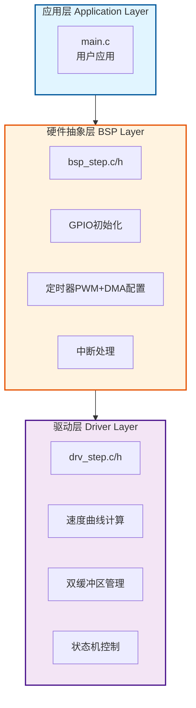
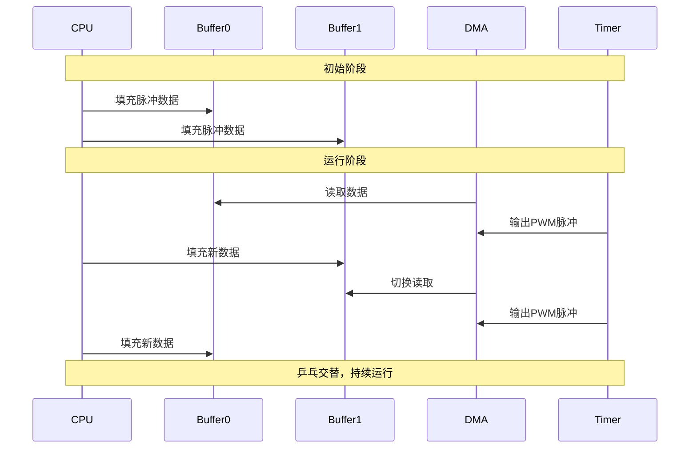

# Stepper-motor-algorithm-controller

采用定时器PWM输出通道模式+DMA传输
基于ZheWana固件库的步进电机算法控制驱动，支持AT32系列微控制器的高精度步进电机控制。

## 功能特性

- **双模式控制**：支持Tacc自动规划模式和固定脉冲分段模式
- **多曲线加速算法**：支持梯形曲线和S曲线两种加速模式
- **DMA双缓冲技术**：采用双缓冲区机制，确保脉冲输出的连续性和实时性
- **三阶段速度控制**：完整的加速、匀速、减速控制流程
- **多电机独立控制**：支持同时控制多个步进电机，每个电机独立配置
- **硬件PWM驱动**：利用定时器PWM输出配合DMA，实现高精度脉冲生成
- **方向控制**：支持正反向旋转控制
- **可配置参数**：最小/最大频率、加速时间、分段脉冲数等参数可灵活配置

## 硬件要求

- **微控制器**：AT32F403ARGT7
- **系统时钟**：最高支持240MHz
- **外设要求**：
  - 定时器（TIM2/TIM5等）
  - GPIO（用于方向控制）
  - DMA（用于PWM脉冲传输）

## 软件架构



## 核心算法

### 控制模式

**Tacc自动规划模式**

根据加速时间Tacc自动计算加速步数，适用于需要基于时间控制的场景。

**固定脉冲分段模式**

直接指定加速/匀速/减速三段的脉冲数量，适用于需要精确控制各阶段步数的场景。

### 速度曲线

**梯形曲线（Trapezoidal）**


**S曲线（S-Curve）**


**曲线对比**

| 特性    | 梯形曲线 | S曲线  |
| ----- | ---- | ---- |
| 加速度变化 | 阶跃变化 | 连续平滑 |
| 机械冲击  | 较大   | 较小   |
| 运动平滑性 | 一般   | 优秀   |
| 计算复杂度 | 低    | 中    |
| 适用场景  | 高速定位 | 精密运动 |

### 双缓冲机制



## 配置选项

在 `drv_step.h` 中可配置以下参数：

```c
#define RCC_MAX_FREQUENCY  240000000      // 系统时钟频率 (Hz)
#define AutoInitBuffer    (1)            // 自动初始化缓冲区
#define AcclerateCurve    Curve_Trapezoidal  // 加速曲线类型
#define BufferSize        (512)          // 双缓冲区大小
```

## 使用方法

### 1. 初始化硬件

```c
bsp_step_init();  // 初始化步进电机GPIO、定时器和DMA
```

### 2. 配置步进电机

```c
Step_Init(&step2,                         // 电机句柄
          TMR2,                           // 定时器
          TMR_SELECT_CHANNEL_2,           // 定时器通道
          GPIOB,                          // GPIO端口
          GPIO_PINS_1,                    // GPIO引脚
          500,                            // 最小频率 (Hz)
          8000,                           // 最大频率 (Hz)
          500);                           // 加速时间 (ms)
```

### 3. 启动电机

**Tacc自动规划模式**

```c
step_move_start_pwm(&step2,              // 电机句柄
                    6400,                // 目标步数
                    DIR_RIGHT,           // 方向 (1:正向, 0:反向)
                    Decelerate_USE);     // 是否使用减速
```

**固定脉冲分段模式**

```c
step_move_start_pwm_fixed(&step2,        // 电机句柄
                          6400,          // 总脉冲数
                          1400,          // 加速脉冲数
                          3600,          // 匀速脉冲数
                          1400,          // 减速脉冲数
                          DIR_RIGHT);    // 方向 (1:正向, 0:反向)
```

### 4. 主循环扫描

```c
while(1)
{
    os_step_move_scan();  // 扫描并填充缓冲区
}
```

## API接口说明

### 核心函数

| 函数名                             | 功能描述                |
| ------------------------------- | ------------------- |
| `Step_Init()`                   | 初始化步进电机控制结构体        |
| `Step_Prefill()`                | 预填充缓冲区，启动电机（Tacc模式） |
| `Step_PrefillFixed()`           | 预填充缓冲区，启动电机（固定分段模式） |
| `Step_BuffFill()`               | 运行时填充缓冲区            |
| `Step_BufferUsed()`             | 缓冲区使用完成回调           |
| `Step_Abort()`                  | 中止电机运行              |
| `Step_Lock()` / `Step_Unlock()` | 锁定/解锁电机控制           |

### 辅助函数

| 函数名                          | 功能描述             |
| ---------------------------- | ---------------- |
| `Step_IsBuffRdy()`           | 检查缓冲区是否就绪        |
| `Step_GetCurBuffer()`        | 获取当前缓冲区指针        |
| `Step_BuffUsedLength()`      | 获取缓冲区使用长度        |
| `Step_FillAccelerate()`      | 填充加速阶段脉冲（Tacc模式） |
| `Step_FillConstant()`        | 填充匀速阶段脉冲（Tacc模式） |
| `Step_FillDecelerate()`      | 填充减速阶段脉冲（Tacc模式） |
| `Step_FillAccelerateFixed()` | 填充加速阶段脉冲（固定分段模式） |
| `Step_FillConstantFixed()`   | 填充匀速阶段脉冲（固定分段模式） |
| `Step_FillDecelerateFixed()` | 填充减速阶段脉冲（固定分段模式） |

## 示例代码

完整示例参见 `main.c`：

```c
int main(void)
{
    // 初始化
    bsp_step_init();
    Step_Init(&step2, TMR2, TMR_SELECT_CHANNEL_2, GPIOB, GPIO_PINS_1, 500, 8000, 500);
    Step_Init(&step3, TMR5, TMR_SELECT_CHANNEL_3, GPIOA, GPIO_PINS_3, 500, 8000, 500);
    
    // Tacc自动规划模式启动
    step_move_start_pwm(&step2, 6400, DIR_RIGHT, Decelerate_USE);
    
    // 固定脉冲分段模式启动
    step_move_start_pwm_fixed(&step3, 32000, 5000, 22000, 5000, DIR_RIGHT);
    
    // 主循环
    while(1)
    {
        os_step_move_scan();
    }
}
```

## 文件结构

```
Stepper-motor-algorithm-controller/
├── code/    
│   ├── bsp/
│   │    ├── bsp_step.c  # 硬件抽象层实现
│   │    └── bsp_step.h  # 硬件抽象层头文件
│   ├── drv/
│   │    ├── drv_step.c  # 算法驱动层实现
│   │    └── drv_step.h  # 算法驱动层头文件
│   └── main.c           # 主程序示例
├── README.md            # 项目说明文档
└── LICENSE              # 许可证文件
```

## 技术参数

- **脉冲频率范围**：500Hz \~ 8000Hz（可配置）
- **缓冲区大小**：512个脉冲（可配置）
- **支持电机数量**：受限于定时器和DMA资源
- **加速时间**：可配置（典型值500ms）
- **控制精度**：基于定时器PWM，精度取决于时钟频率

## 性能特点

- **低CPU占用**：DMA传输脉冲，CPU仅负责缓冲区填充
- **高实时性**：双缓冲机制确保脉冲连续输出
- **平滑运动**：S曲线算法减少机械冲击
- **灵活配置**：支持多种速度曲线和参数组合

## 注意事项

1. 确保定时器和DMA资源未被其他外设占用
2. 根据电机特性调整最小/最大频率和加速时间
3. 缓冲区大小应根据系统负载和实时性要求调整
4. 多电机同时运行时需注意总脉冲频率限制
5. 方向控制GPIO需正确配置为输出模式

## 许可证

Copyright (c) 2025, Artery Technology, All rights reserved.

本软件按"原样"提供，不提供任何明示或暗示的保证。详见LICENSE文件。

## 参考项目

本项目参考了以下开源项目：

- [ZheWana/2023-Work-training-competition-software](https://github.com/ZheWana/2023-Work-training-competition-software/tree/master/Controler/UserCode/StepHelper) - 步进电机算法核心实现
- 本项目的HAL库形式可参考如上链接

## 作者

Z1R343L

## 版本历史

- v1.1.0 - 新增固定脉冲分段模式，支持精确控制加速/匀速/减速各阶段脉冲数
- v1.0.0 - 初始版本，支持梯形/S曲线加速和DMA双缓冲

