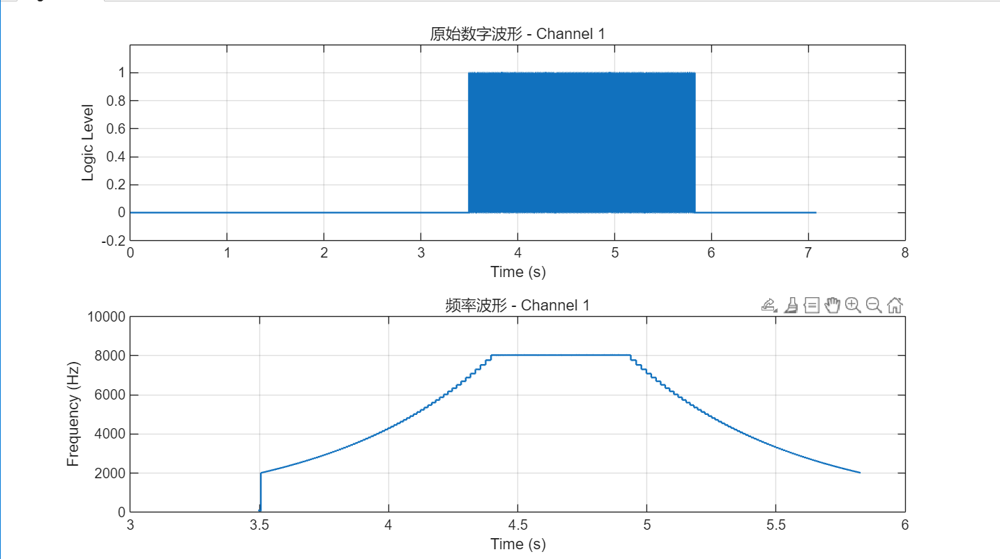

# Stepper Motor Algorithm Controller

基于定时器 PWM 输出和 DMA 传输的步进电机脉冲控制器。项目核心代码面向 AT32F403A/407 标准外设库，实现了步进电机梯形曲线 / S 曲线加减速、PWM+DMA 双缓冲连续输出，以及按固定脉冲段规划运动的控制接口。

仓库同时提供 AT32F403ARGT7 与 STM32F407VGT6 示例工程，便于在不同 MCU 平台上验证和移植。

## 功能特点

- 支持两种运动规划方式：按加速时间 `Tacc` 自动规划，或手动指定加速、匀速、减速三段脉冲数。
- 支持梯形曲线与 S 曲线两种速度曲线。
- 使用定时器 PWM 输出脉冲，DMA 持续更新定时器分频值，实现运行中变频。
- 双缓冲区填充机制，降低主循环阻塞对脉冲连续性的影响。
- 支持多电机实例，每个电机拥有独立的定时器、通道、方向 GPIO 和运动状态。
- 提供 MATLAB 频率曲线分析脚本，可配合逻辑分析仪导出的 CSV 验证输出效果。

## 仓库结构

```text
Stepper-motor-algorithm-controller/
├─ code/
│  ├─ bsp/
│  │  ├─ bsp_step.c       # AT32 硬件适配层：GPIO、TMR、DMA、中断
│  │  └─ bsp_step.h
│  ├─ drv/
│  │  ├─ drv_step.c       # 步进电机运动规划与双缓冲填充
│  │  └─ drv_step.h
│  └─ main.c              # 最小使用示例
├─ example/
│  ├─ AT32F403ARGT7/      # AT32 完整 Keil 示例工程
│  └─ STM32F407VGT6/      # STM32F407 HAL 示例工程
├─ img/
│  └─ curve.png           # 输出频率曲线示例图
├─ matlab/
│  ├─ digital.csv         # 示例采样数据
│  └─ frequency_curve.m   # 频率曲线分析脚本
├─ LICENSE
└─ README.md
```

## 核心原理

驱动层把目标速度曲线转换为一组定时器分频值，并写入双缓冲区。DMA 以 memory-to-peripheral 模式把缓冲区中的分频值写入定时器分频寄存器，使 PWM 输出频率随运动阶段变化。

运行流程如下：

```text
Step_Init()
  -> 配置电机对象、速度参数、方向 GPIO、PWM 占空比

Step_Prefill() / Step_PrefillFixed()
  -> 根据运动参数预填充第一个脉冲缓冲区

tmr_pwm_start_dma()
  -> 启动定时器 PWM 和 DMA

DMA 完成中断
  -> Step_BufferUsed()
  -> Step_BuffFill()
  -> 标记下一段缓冲区可发送

主循环 os_step_move_scan()
  -> 检查缓冲区状态
  -> 继续启动下一段 DMA 传输
```

## 速度曲线

### 梯形曲线

梯形曲线采用线性加速、匀速、线性减速。计算简单，适合对平滑性要求不高、追求实现成本低的场景。

### S 曲线

S 曲线使用余弦函数平滑加减速，可减少机械冲击，更适合负载较大或需要柔顺启停的运动场景。

在 `code/drv/drv_step.h` 中修改：

```c
#define AcclerateCurve (Curve_Trapezoidal)
/* 或 */
#define AcclerateCurve (Curve_S)
```

## 主要配置

配置项位于 `code/drv/drv_step.h`：

```c
#ifndef RCC_MAX_FREQUENCY
#define RCC_MAX_FREQUENCY 240000000
#endif

#define AutoInitBuffer (1)
#define AcclerateCurve (Curve_Trapezoidal)
#define BufferSize     (512)
```

| 配置项                | 说明                                                 |
| --------------------- | ---------------------------------------------------- |
| `RCC_MAX_FREQUENCY` | 定时器输入时钟频率，需按实际 MCU 时钟配置修改        |
| `AutoInitBuffer`    | 是否在初始化时清零双缓冲区                           |
| `AcclerateCurve`    | 加减速曲线类型：`Curve_Trapezoidal` 或 `Curve_S` |
| `BufferSize`        | 单个缓冲区可容纳的脉冲数                             |

## 快速上手

### 1. 初始化 BSP

```c
bsp_step_init();
```

该函数完成方向 GPIO、定时器 PWM、DMA 和 DMA 中断初始化。移植到新硬件时，优先修改 `code/bsp/bsp_step.c`。

### 2. 初始化电机对象

```c
Step_Init(&step2,
          TMR2,
          TMR_SELECT_CHANNEL_2,
          GPIOB,
          GPIO_PINS_1,
          500,
          8000,
          500);
```

参数含义：

| 参数                     | 说明                  |
| ------------------------ | --------------------- |
| `hstep`                | 电机控制对象          |
| `tmr`                  | 输出 PWM 的定时器     |
| `channel`              | 定时器通道            |
| `GPIOx` / `GPIO_Pin` | 方向控制 GPIO         |
| `Fmin`                 | 最小脉冲频率，单位 Hz |
| `Fmax`                 | 最大脉冲频率，单位 Hz |
| `Tacc`                 | 加速时间，单位 ms     |

### 3. 启动运动

按 `Tacc` 自动规划：

```c
step_move_start_pwm(&step2,
                    6400,
                    DIR_RIGHT,
                    Decelerate_USE);
```

固定三段脉冲数规划：

```c
step_move_start_pwm_fixed(&step2,
                          12000,
                          4000,
                          4000,
                          4000,
                          DIR_RIGHT);
```

固定三段模式要求：

```text
totalPulse = accPulse + constPulse + decPulse
```

否则 `Step_PrefillFixed()` 会返回 `-1`。

### 4. 主循环扫描

```c
while (1)
{
    os_step_move_scan();
}
```

`os_step_move_scan()` 检查电机对象的缓冲区就绪标志，并调用 `tmr_pwm_start_dma()` 继续输出下一段脉冲。

## 常用 API

| API                                 | 说明                               |
| ----------------------------------- | ---------------------------------- |
| `Step_Init()`                     | 初始化步进电机控制对象             |
| `Step_Prefill()`                  | 按 `Tacc` 模式预填充缓冲区       |
| `Step_PrefillFixed()`             | 按固定三段脉冲数模式预填充缓冲区   |
| `Step_BuffFill()`                 | 根据当前运动阶段填充下一段缓冲区   |
| `Step_BufferUsed()`               | DMA 完成后更新剩余脉冲、位置和状态 |
| `Step_IsBuffRdy()`                | 判断缓冲区是否已经填充完成         |
| `Step_GetCurBuffer()`             | 获取当前可发送的缓冲区地址         |
| `Step_BuffUsedLength()`           | 获取当前缓冲区有效长度             |
| `Step_Lock()` / `Step_Unlock()` | 运动互斥锁，避免重复启动           |
| `Step_Abort()`                    | 中止当前运动并关闭定时器           |
| `step_move_start_pwm()`           | 启动 `Tacc` 自动规划运动         |
| `step_move_start_pwm_fixed()`     | 启动固定三段脉冲数运动             |

## 硬件资源

根目录 `code/` 中的默认 AT32 BSP 示例使用如下资源：

| 电机对象  | PWM 输出     | DMA 通道          | 方向 GPIO               |
| --------- | ------------ | ----------------- | ----------------------- |
| `step2` | `TMR2_CH2` | `DMA1_CHANNEL6` | 由 `Step_Init()` 指定 |
| `step3` | `TMR5_CH3` | `DMA1_CHANNEL7` | 由 `Step_Init()` 指定 |

实际引脚、定时器、DMA 请求映射需要根据芯片手册和工程配置调整。移植时重点检查：

- 定时器输入时钟是否与 `RCC_MAX_FREQUENCY` 一致。
- PWM 通道是否正确配置为复用输出。
- DMA 请求是否绑定到对应定时器通道。
- DMA 中断中是否按顺序调用 `Step_BufferUsed()` 和 `Step_BuffFill()`。
- 方向 GPIO 电平是否与驱动器 DIR 极性一致。

## 示例工程

### AT32F403ARGT7

路径：`example/AT32F403ARGT7`

该工程使用 AT32 标准外设库，包含 BSP、驱动、系统初始化和 Keil MDK 工程文件，可作为根目录 `code/` 的完整验证工程。

### STM32F407VGT6

路径：`example/STM32F407VGT6`

该工程为 STM32F407 HAL 移植示例，包含 `Step/` 中的 S 曲线控制代码、CubeMX 工程文件和 Keil 工程文件。相关移植说明见：

```text
example/STM32F407VGT6/Step/Docs/步进电机S曲线HAL移植技术总结.md
```

## 波形与频率分析

可使用 Saleae Logic 等逻辑分析仪采集 PUL 引脚波形，并导出为 CSV。将 CSV 放到 `matlab/` 目录后运行：

```matlab
frequency_curve
```

脚本会自动寻找存在跳变的数字通道，计算相邻上升沿周期，并绘制原始数字波形和频率曲线。

示例运动参数：

```c
Step_Init(&step2, TMR2, TMR_SELECT_CHANNEL_2, GPIOB, GPIO_PINS_1, 2000, 8000, 100);
step_move_start_pwm_fixed(&step2, 12000, 4000, 4000, 4000, DIR_RIGHT);
```

输出频率曲线示例：



## 移植建议

1. 先确认目标 MCU 的定时器时钟、PWM 通道和 DMA request 映射。
2. 在 BSP 层实现 `bsp_step_init()`、`tmr_pwm_start_dma()` 和 DMA 中断处理。
3. 保持驱动层 `drv_step.c/.h` 尽量不依赖具体芯片，只在 BSP 中处理寄存器和外设库差异。
4. 如果低速频率下定时器分频值超出范围，调整定时器预分频或 `RCC_MAX_FREQUENCY`。
5. 初次调试建议降低 `Fmax` 和加速度，确认方向、脉冲数、停止逻辑正常后再提高速度。
6. 多电机同时运行时，需要评估 DMA 资源、中断频率和 CPU 填充缓冲区的实时性。

## 注意事项

- `Step_Prefill()` / `Step_PrefillFixed()` 会加锁，同一电机运行未结束前再次启动会失败。
- `Step_Abort()` 会停止定时器并解锁，可用于急停或异常恢复。
- 方向引脚在运动启动前设置；如实际方向相反，可交换 DIR 极性或修改方向宏。
- 固定三段模式下，三段脉冲数之和必须等于总脉冲数。
- DMA 完成中断中需要及时填充下一段缓冲区，否则高速运行时可能出现脉冲间断。
- example并非使用本算法库，而是更精细化的S曲线算法

## 参考项目

- [ZheWana/2023-Work-training-competition-software](https://github.com/ZheWana/2023-Work-training-competition-software/tree/master/Controler/UserCode/StepHelper)

## 作者

Z1R343L

## 许可证

本项目使用 GPL-3.0 许可证，详见 [LICENSE](LICENSE)。

## 版本记录

- `v1.2.2`：优化频率分析脚本，新增自定义频率范围过滤、交互式视图缩放和快捷键支持。
- `v1.2.1`：新增 MATLAB 频率曲线分析脚本，配合逻辑分析仪 CSV 数据验证输出。
- `v1.2.0`：优化 `os_step_move_scan()`，通过 DMA 中断填充缓冲区，减少脉冲丢失风险。
- `v1.1.0`：新增固定脉冲分段模式，支持精确控制加速、匀速、减速各阶段脉冲数。
- `v1.0.0`：初始版本，支持梯形 / S 曲线加减速和 DMA 双缓冲输出。
